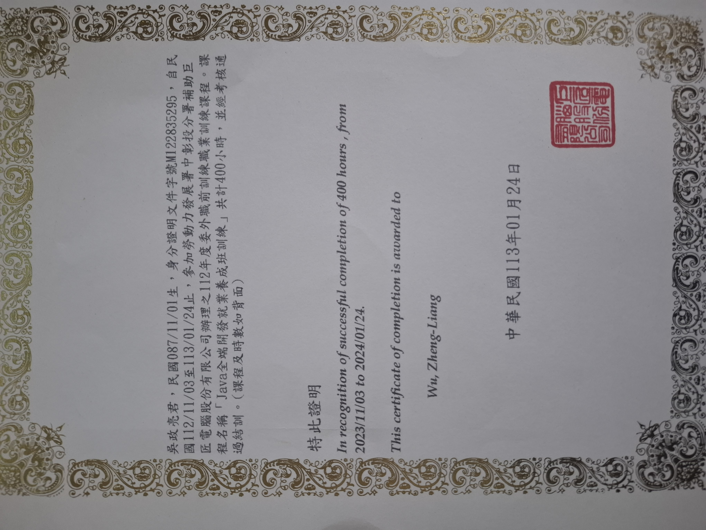
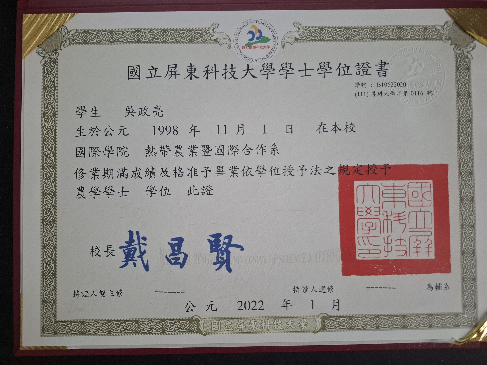
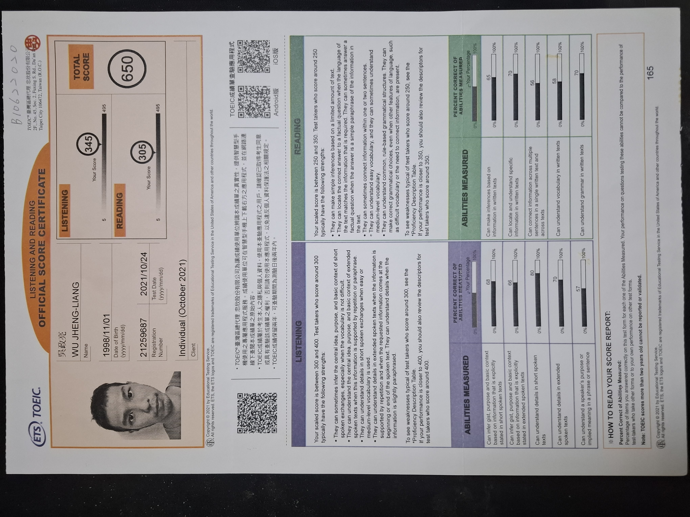

# Hi, I'm Zheng-Liang Wu (吳政亮) 👋

### 🚀 轉職中的資安工程師 | Security Engineer Trainee

- 💻 **技術棧**：
  - **開發安全**：Java(Spring Boot), Python, SQL (MariaDB)
  - **系統網路**：Linux (Ubuntu), TCP/IP 協定分析, SSH 
- 🛡️ **專業證照**：ISC2 Certified in Cybersecurity (CC) 
- 🎯 **求職目標**：目前積極準備 **CCNA** 中，尋求台中地區 SOC 分析師或資安職務。

---

### 🎓 專業認證與學位 (Certifications & Education)

  
🔍 點擊展開查看詳細證書

  #### 🛡️ 資訊安全專業認證
  - **ISC2 Certified in Cybersecurity (CC)**
  - 於 2026 年考取，掌握資安五大領域基礎。
   

  #### ☕ 程式開發技術訓練
  - **Java 全端開發就業養成班 - 結訓證書** 
  - 涵蓋 Spring Boot 框架與 MariaDB 資料庫應用。 
   

  #### 🎓 學士學位
  - **國立屏東科技大學 - 熱帶農業系** 
   

  ### 🌐 語言能力 (Languages)
  - **中文 (Mandarin)** - 母語
  - **英文 (English)** - 中級 (**TOEIC 650**)
  - 能夠理解英文技術文件與開發者論壇內容。
  - 具備撰寫基礎英文說明文件 (**Documentation**) 的能力。
  

---

### 🛠️ 精選專案 (Selected Projects)
- [TicketWebsite - 購票系統開發](https://github.com/Zheng-Liang-Wu/TicketWebsite)基於 Spring Boot 與 MariaDB 打造的全端 Web 應用。
    - **核心實作**：獨立完成 MVC 架構設計、使用者認證與資料庫 CRUD 操作。
    - **邏輯處理**：實作 Session 狀態管理與動態票券庫存更新，確保系統資料一致性與流暢的操作體驗。
- **[麻將台數計算機](https://github.com/Zheng-Liang-Wu/Mahjong-Score-Calculator)**
  - 為解決家人聚會計分爭議而開發的 Web 工具。透過原生 JavaScript 處理複雜的連莊與自摸邏輯，並從中實踐前端輸入驗證與資料完整性檢查。
- **[Linux 學習紀錄與資安筆記](你的紀錄連結)**
  - 整理常用的 Linux 指令、Firewall 配置與網路分析心得。 
---

### 📫 聯絡資訊
- **Email**: a22852206@gmail.com
- **LinkedIn**: [吳政亮](https://www.linkedin.com/in/政亮-吳-814911315)
