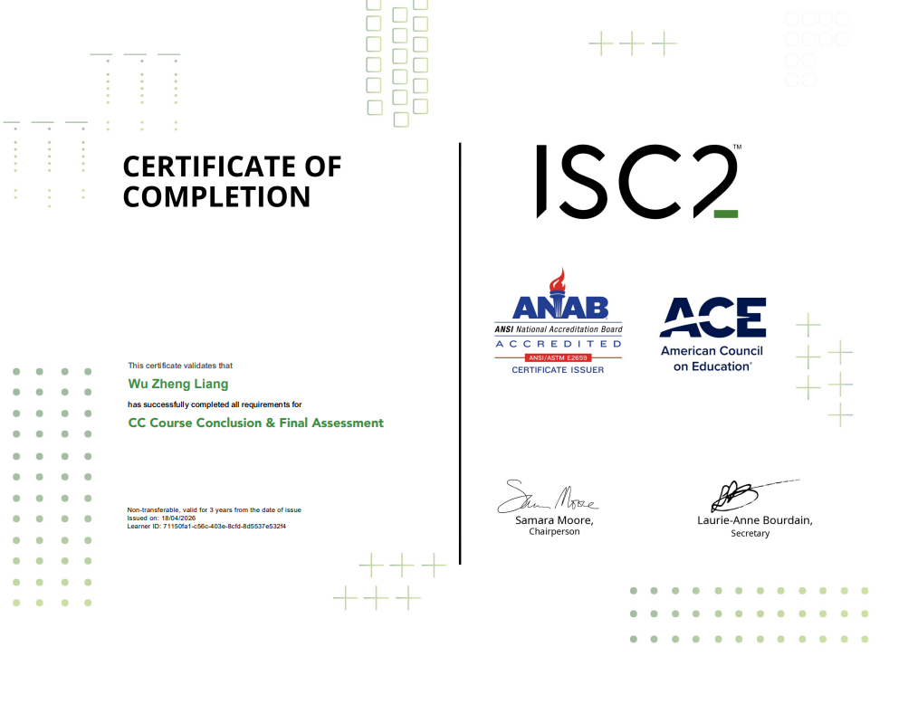

# Hi, I'm Zheng-Liang Wu (吳政亮) 👋

### 🚀 轉職中的資安工程師 | Security Engineer Trainee

- 💻 **技術棧**：
  - [cite_start]**開發安全**：Java (Spring Boot), Python, SQL (MariaDB) [cite: 46, 47, 48]
  - [cite_start]**系統網路**：Linux (Ubuntu), TCP/IP 協定分析, SSH [cite: 53, 54, 56]
- [cite_start]🛡️ **專業證照**：ISC2 Certified in Cybersecurity (CC) [cite: 41]
- [cite_start]🎯 **求職目標**：目前積極準備 **CCNA** 中，尋求台中地區 SOC 分析師或資安職務 [cite: 15, 16]。

---

### 🎓 專業認證與學位 (Certifications & Education)

  
🔍 點擊展開查看詳細證書

  #### 🛡️ 資訊安全專業認證
  - **ISC2 Certified in Cybersecurity (CC)**
  - [cite_start]於 2026 年考取，掌握資安五大領域基礎。 [cite: 41, 68]
  - 

  #### ☕ 程式開發技術訓練
  - [cite_start]**Java 全端開發就業養成班 - 結訓證書** [cite: 75]
  - [cite_start]涵蓋 Spring Boot 框架與 MariaDB 資料庫應用。 [cite: 47, 48]
  - 

  #### 🎓 學士學位
  - [cite_start]**國立屏東科技大學 - 熱帶農業系** [cite: 8, 9]
  - 
  - *(註：敏感資訊已遮蓋)*

---

### 🛠️ 精選專案 (Selected Projects)
- [cite_start]**[TicketWebsite - Java 全端開發](https://github.com/Zheng-Liang-Wu/TicketWebsite)** [cite: 50]
  - [cite_start]使用 Spring Boot 與 MariaDB 建立，並實作基礎的安全防護邏輯。 [cite: 47, 48]
- **[Linux 學習紀錄與資安筆記](你的紀錄連結)**
  - [cite_start]整理常用的 Linux 指令、Firewall 配置與網路分析心得。 [cite: 52, 54]

---

### 📫 聯絡資訊
- [cite_start]**Email**: a22852206@gmail.com [cite: 6]
- **LinkedIn**: [政亮 吳](https://www.linkedin.com/in/政亮-吳-814911315)
